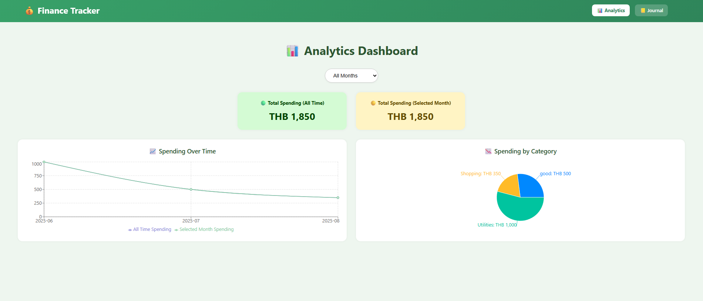

# Finance App

# Members
Anuson Khwansakun
Tihong Chhiv

A modern, single-user finance tracking application built with React and Vite. Track your spending, analyze your financial patterns, and manage your budget with charts and intuitive interface.

## Features

### 📊 Analytics Dashboard
- **Time Period Selection**: View spending data by Daily, Weekly, Monthly, or Yearly periods
- **Month Filtering**: Filter data by specific months or view all-time data
- **Total Spending Summary**: 
  - All-time total spending
  - Selected month total spending
- **Interactive Charts**:
  - **Line Chart**: Shows spending trends over time (all-time vs selected month)
  - **Pie Chart**: Displays spending breakdown by category
  - **Bar Chart**: Visualizes spending by selected time period (Daily/Weekly/Monthly/Yearly)

### 📘 Journal Page
- **Easy Entry Management**: Add spending records with date, category, and amount
- **Predefined Categories**: Use built-in spending categories from `spending-category.json`
- **Custom Categories**: Add your own spending categories that persist in the app
- **Data Validation**: Form validation ensures all required fields are filled
- **Entry Management**: View, add, and delete spending entries
- **Real-time Total**: See your total spending update in real-time

### 🎨 Modern UI/UX
- **Responsive Design**: Works seamlessly on desktop and mobile devices
- **Beautiful Charts**: Powered by Recharts for professional data visualization
- **Intuitive Navigation**: Clean navigation between Analytics and Journal pages
- **Local Storage**: All data is saved locally in your browser

## Screenshots

### Analytics Dashboard

### Journal Page

